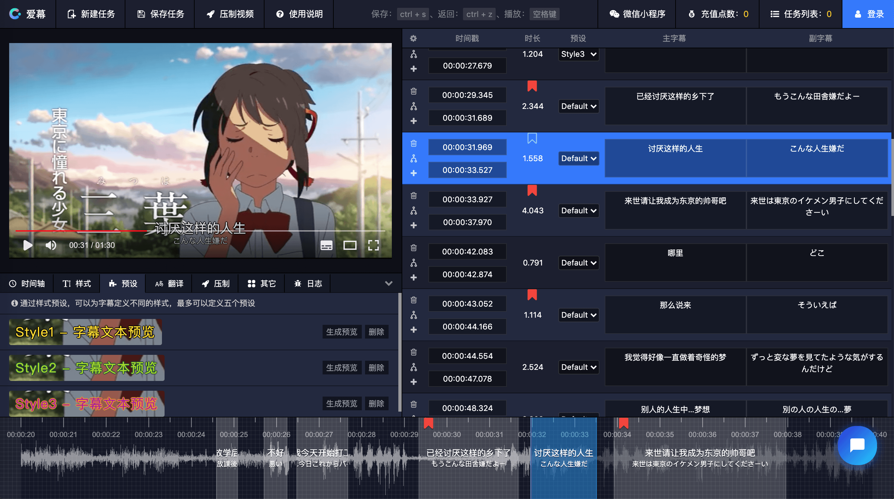

# 全新版本来了

> 适用于中文用户的在线字幕编辑器

-   语音自动转文字
-   字幕翻译 + 双语字幕
-   常见字幕格式导出
-   支持字幕样式调整
-   在线视频格式转换
-   云端解码生成波形图
-   字幕 + 视频一键压制
-   更多等你来发现...

## 官网

[https://online.aimu-app.com](https://online.aimu-app.com)

## 截图

# SubPlayer

> SubPlayer is an online subtitle editor

## Homepage

[https://subplayer.js.org](https://subplayer.js.org)

## Features

-   Support online and real-time preview of subtitles
-   Support `ass`, `srt`, `vtt` subtitle upload editing
-   Support subtitle insertion, deletion , offset and merging
-   Support Google translation
-   Support for subtitle history rollback
-   Support saving to local storage
-   Support multi-channel audio waveform
-   Support space metronome
-   Support drag time to generate subtitles
-   And more...

## Donations

We accept donations through these channels:

-   [Patreon](https://www.patreon.com/artplayer)
-   [Paypal](https://www.paypal.me/harveyzack)

## QQ Group

## License

MIT © [Harvey Zack](https://sleepy.im/)
