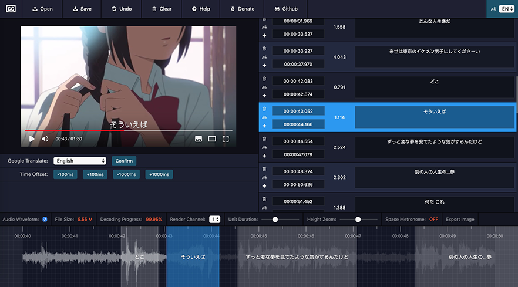

# SubPlayer

> SubPlayer is an online subtitle editor

## Homepage

[https://subplayer.js.org](https://subplayer.js.org)

## Features

-   Support online and real-time preview of subtitles
-   Support `ass`, `srt`, `vtt` subtitle upload editing
-   Support subtitle insertion, deletion , offset and merging
-   Support Google translation
-   Support for subtitle history rollback
-   Support saving to local storage
-   Support multi-channel audio waveform
-   Support space metronome
-   Support drag time to generate subtitles
-   And more...

## Donations

We accept donations through these channels:

-   [Paypal](https://www.paypal.me/harveyzack)
-   [WeChat Pay](./images/wechatpay.jpg)
-   [Alipay](./images/alipay.jpg)

## QQ Group

## License

MIT © [Harvey Zack](https://sleepy.im/)
